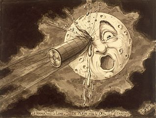

# checkpoint4cinefront
## Les origines du cinéma 1895 - 1929 - front

### ✨ To install locally:

- Make sure you have the 2 repositories you need to clone:  
https://github.com/Tadkozh/checkpoint4cinefront  
https://github.com/Tadkozh/checkpoint4cineback
- **npm install** for both

- Create the DB from the *cinema.sql* file in the *db* folder on the back side  
- Link the back to the DB : duplicate *.env.sample* to *.env* and replace with your data

- Link the front to the back: duplicate *.env* to *.env.local* and replace with your data

- **npm start** for both repo

      
    *Le Voyage dans la Lune - Georges Méliès*
